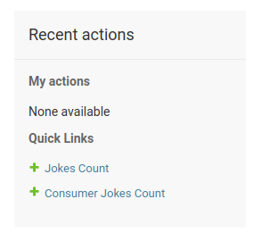

# django-bot-server

Accompanying repository for a seminar on creating a django based bot server that uses django-channels for  WebSockets connection. This borrows heavily from the code at https://github.com/nidhisha123/chat-bot-server 

# What is this useful for?

- Get an idea how to get django-channels working
- Get some sample code for a simple working front end that uses web sockets for a connection

# How to use this branch

This part of the seminar involves installing and getting started with django channels.

To get this running, simply run the  the following 

## Step 1: Install requirements.txt

`pip install -r requirements.txt`

## Step 2: Create databases

Create the databases and the initial migrations with the following command:
`python manage.py migrate`

## Step 3: Run server

And start the server with 

`python manage.py runserver`

You should now be able to go to localhost:8000/chat/ and chat with the bot

## Step 4: Create a superuser

`python manage.py createsuperuser`

Create superuser to view custom views (Joke's button clicks count and user wise clicks count)
Add required permissions

## Jokes count report

- Login to the website
- You can see the total number of the funny button clicks on this URL - localhost:8000/jokes-count/
- It is an admin view

## User wise jokes count report

- Login to the website
- You can see the total number of the funny button clicks based on users on this URL - localhost:8000/consumer-jokes-count/
- user can see their total clicks on each jokes ( User login URL -  localhost:8000/login. logout URL - localhost:8000/logout)

## Additional Data
- Admin can also access these two link from admin panel 

